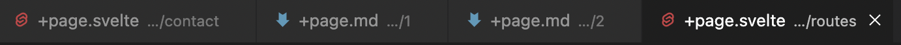
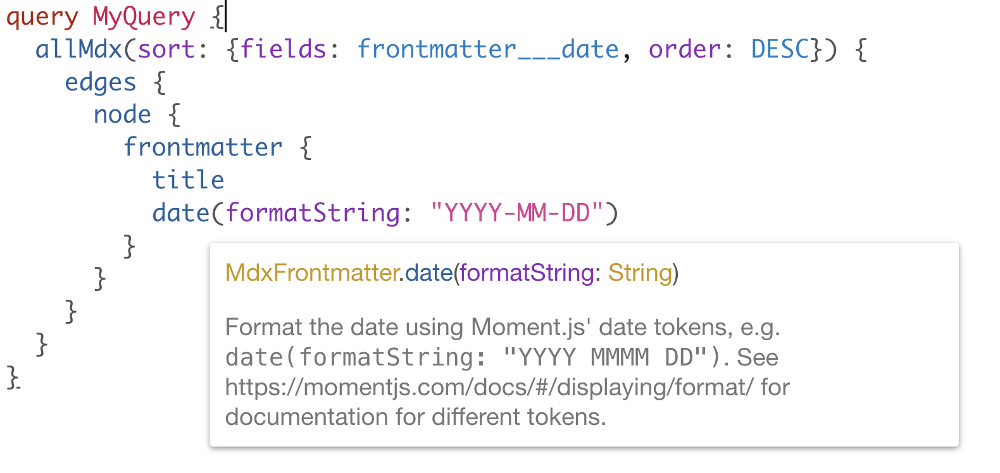
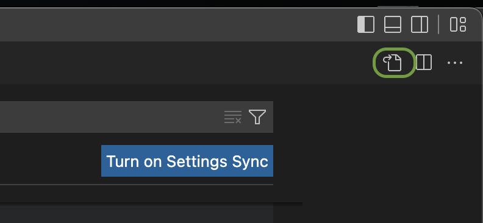
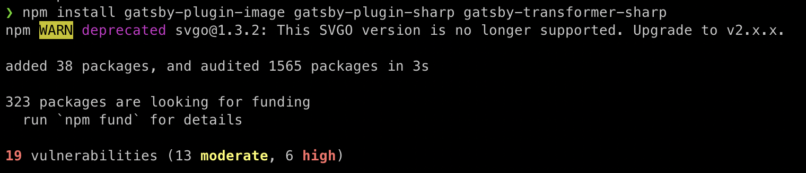

For a while, I had thought of creating a space where I can post some progress and learnings from my projects. This blog is now it, and this first post is a short summary of how I built it.

## Starting with SvelteKit

Personal projects are always good places to experiment with new technology. I had looked at Svelte for a long time, and thought this would be the moment where I try it. SvelteKit, the Svelte equivalent of Gatsby/Next.js, is still in beta, but I spun up a project and started testing it out. First impressions were great. It's lightweight, my node modules were way fewer than when using Gatsby or Next, and hot reloading is instant with Vite. However, there were some things I started to dislike.

First, the folder system for routing is a bit weird. Inside the `src` folder, the folder `routes` is where pages are defined. Now, instead of e.g. `contact.tsx` becoming the route /contact like every other framework, you have to create a folder with the name of your route, and inside that create the `+page.svelte` . The result is a lot of files with the same name, so your tab bar in VS Code eventually looks like this:



which is not a great experience. Apparently the change in SvelteKit to this way of defining routes was recent, so hopefully they can switch back.

But the thing that made me give up SvelteKit was the way the equivalent of MDX, MDSvex, is integrated. I wanted a lightweight blog without a backend, i.e. a static site where posts are MDSvex files. Easy enough, but apparently not. The MDSvex standard plugin proved to be difficult to implement, especially if you wanted some sort of add-ons with Remark plugins. Also, being used to the built-in GraphQL support in Gatsby, having to write scripts that query the blog posts for the home page was a hassle. So then I switched to Gatsby.

## Starting with Gatsby

The basic architecture I settled for is as follows: Gatsby as a static site generator, deployed on Netlify, that rebuilds when the main branch updates on GitHub. Styling was done with TailwindCSS, and posts written as MDX files. Typescript was obviously the language of choice here, which works incredibly well with Gatsby. They now include GraphQL query type generation by default.

### MDX and Gatsby

I love Gatsby's integration with GraphQL, and how it integrates with MDX/Markdown. How it handles e.g. dates is awesome. If you put a date without quotation marks in the frontmatter like so:

```jsx
---
title: Creating a blog using SvelteKit
date: 2021-12-14
slug: /post-1
---
```

it picks up that it is a date, and then we can format it in the GraphQL query with `formatString` (with nice autocompletion):



which is awesome.

### Some learnings along the way

- Adding a new path causes Gatsby to freeze on “Preparing requested page”. Clearing the browser cache solved this. An [SO post](https://stackoverflow.com/questions/66681392/gatsby-error-when-creating-a-new-route-preparing-requested-page) attributes this to the M1 chip 🤔
- Gatsby relies heavily on its own plugins. However, these seem to be quite poorly maintained for some reason? When installing the required image plugins, we see some high severity warnings from NPM. Overall, Gatsby feels quite package-heavy, and I look forward to seeing SvelteKit being more production ready.

## Conclusion

Gatsby does it job. It’s a great developer experience all around. Looking forward to creating some content here.

## Appendix

These sections serve mostly as reference for myself.

### Install Prettier and ESLint with Gatsby

Nowadays ESLint is shipped with Gatsby. We only need to configure Prettier and add our own `eslintrc` file. To configure Prettier, first install some packages:

```jsx
npm i -D eslint-config-prettier eslint-plugin-prettier prettier
```

and add (my opinionated version below) a `.prettierrc` file:

```jsx
{
  semi: false,
  tabWidth: 2,
  singleQuote: true,
  trailingComma: "all",
  printWidth: 80,
  arrowParens: "always",
}
```

Also add a `.eslintrc.js` file. There are many ways you can configure it, the most important thing though is that you in the `extends` array add

```jsx
'plugin:prettier/recommended'
```

at the end. For reference, here is my full `.eslintrc.js`. It may not be perfect; I have kept it around and used in multiple projects for some years now.

```jsx
module.exports = {
  parser: '@typescript-eslint/parser', // Specifies the ESLint parser
  extends: [
    'eslint:recommended',
    'plugin:react/recommended',
    'plugin:@typescript-eslint/recommended',
    'plugin:prettier/recommended',
  ],
  settings: {
    react: {
      version: 'detect',
    },
  },
  env: {
    browser: true,
    node: true,
    es6: true,
  },
  plugins: ['@typescript-eslint', 'react'],
  parserOptions: {
    ecmaFeatures: {
      jsx: true,
    },
    ecmaVersion: 2018, // Allows for the parsing of modern ECMAScript features
    sourceType: 'module', // Allows for the use of imports
  },
  rules: {
    'react/prop-types': 'off', // Disable prop-types as we use TypeScript for type checking
    '@typescript-eslint/explicit-function-return-type': 'off',
    '@typescript-eslint/explicit-module-boundary-types': 'off',
  },
  overrides: [
    // Override some TypeScript rules just for .js files
    {
      files: ['*.js'],
      rules: {
        '@typescript-eslint/no-var-requires': 'off', //
      },
    },
  ],
}
```

It’s nice to have Prettier auto-fix issues on save. To have that in VS Code, go to Settings → Text Editor → Formatting, and press the Open Settings (JSON) button:



There, add the following attributes:

```jsx
"editor.formatOnSave": true,
"editor.defaultFormatter": "esbenp.prettier-vscode"
```

##


