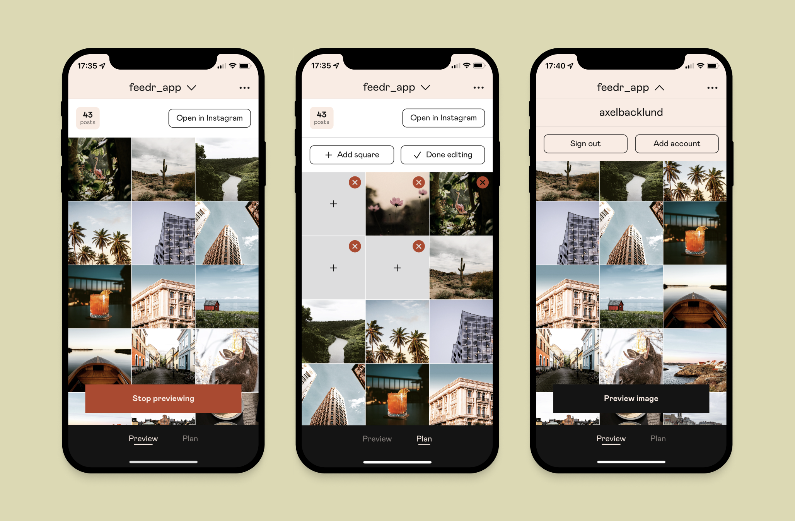
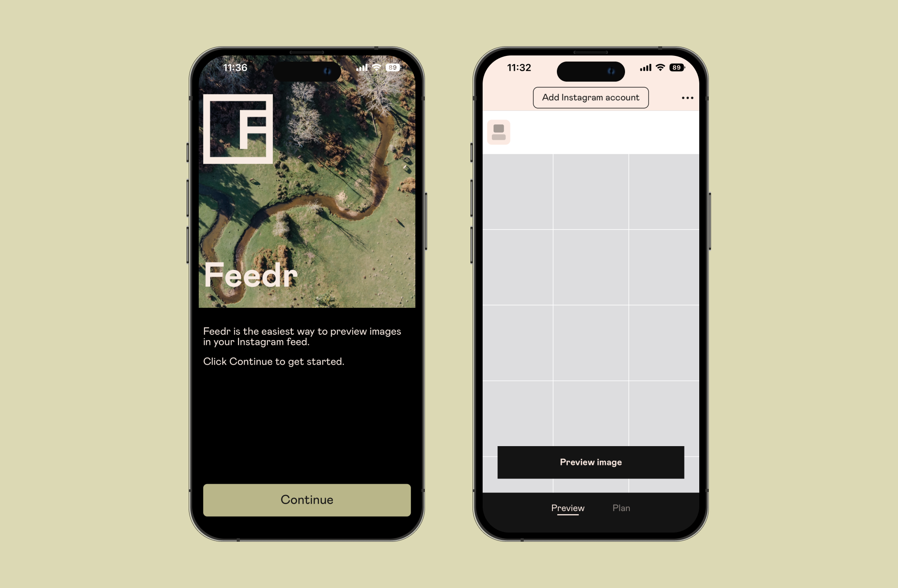

In this post I talk a little about my iOS app Feedr; how it was made and what challenges I faced when working with Facebook's Instagram APIs. It also provides a short summary of the workings of their current Instagram API.

# Background

In 2017, I created the app Feedr. It started as a relatively simple app that allows users to preview photos in their Instagram feeds before posting. In 2018, I added a planning feature. It was all written in Swift and looked like this:


Everything went well, way better than expected. I reached some 250,000 downloads after a couple of years. Then, the Cambridge Analytica scandal happened. Not only did Facebook manage to screw up user privacy completely, they also managed to fail their developers spectacularly in the aftermath. Because one day, Feedr wasn’t working properly anymore. The API calls to Facebook received a 404. This was part of [Facebook’s effort to restrict its APIs](https://techcrunch.com/2018/04/04/facebook-instagram-api-shut-down/), which is understandable from a user privacy standpoint, but it was poorly communicated to us developers.

Facebook then released a new API for Instagram that was way more restricted; none of the data fields present in the screenshots above could be fetched, apart from a user’s media. Moreover, all access tokens created had a short validity, so it became common that users had to sign in again in the app if they hadn’t used it for a while. Not ideal, but I anyways started on a Feedr update to accommodate for these changes. When it was all done and ready to go, Facebook required me to submit the app for review to gain access. Fair enough, I thought. I had to record a video of how the app works and upload it — only to have it rejected.

Apparently I had broken a new rule on how a user should be onboarded to an app using their API. My app had a screen in the beginning which prompted users to log in with their Instagram account, this was seen as a “login screen” and the app did not pass the above criteria. According to their [docs](https://developers.facebook.com/docs/instagram-basic-display-api/),

> **Authentication** — Instagram Basic Display is not an authentication solution. Data returned by the API cannot be used to authenticate your app users or log them into your app. If you need an authentication solution we recommend using [Facebook Login](https://developers.facebook.com/docs/facebook-login) instead.

Very unclear rule by Facebook as Feedr relies 100% on having an Instagram account connected, so why am I not allowed to prompt users to log in first thing when they open the app? I don’t even create an account on my end based on their Instagram account, it’s only to fetch their data.

I tried some other design solutions, such as removing the login screen and instead have a “Connect Instagram” button on the main screen. These did not pass either for the same reason as earlier. Having a lot of work in school at this time, I abandoned the app and removed it from the App Store in wait for better times.

## The SwiftUI rewrite

In January 2022, I figured I wanted to take up Feedr again and get it running. This was a great opportunity to rewrite the app with SwiftUI, which by now has matured quite a bit. I also redesigned the app:



As you can see, it now accommodates for the limitations Instagram has put on what data can be fetched with their API. It only shows the username and number of posts, apart from a user’s media. I also added some new nice-to-have features like dark mode and multi-account support. More importantly, I made it really clear that there was no Instagram “login” when the user started the app for the first time, as can be seen below. The onboarding screen just has a short introduction to the app, and when on the main screen, every feature can be used without logging in. This was accepted by Facebook.



## Using the new Instagram Basic Display API

The new API consists of many different calls that need to be made as a new user starts the app. In short, they are as follows:

1. Get an _authorization code_, using their OAuth login. A side note is that Facebook does not allow custom URI schemes, i.e. we cannot direct their web-based sign-in page back to the app when a user has authenticated. Instead, I had to enter a dummy link which the sign-in page redirects to, that is recognized by the iOS in-app browser. The authorization code is embedded in the dummy URL and extracted by the app, like so:

```swift
guard let code = urlString.slice(from: "code=", to: "#_") else { throw InstagramLoginError.invalidURL }
```

2. Exchange the authorization code for a _short lived token,_ valid for one hour*.*
3. Exchange the _short lived token_ for a _long lived token,_ which is valid for 60 days, and can be refreshed. Store this token securely.
4. Get the user's username/media.

Many different calls that all need to be chained. In Swift, this could lead to [callback hell](https://swiftrocks.com/avoiding-callback-hell-in-swift), but recently they introduced async/await. A very welcome addition which I took advantage of. As an example, this is what the sign in function looks like in the app, quite clean compared to what networking code could look like before.

```swift
func signIn() async throws -> Token { // returns a long-lived token
      let loginURL = try await loginForURL()
      let loginCode = try codeFrom(url: loginURL)
      let shortLivedToken = try await getShortLivedToken(code: loginCode)
      var longLivedToken = try await getLongLivedToken(shortLivedToken: shortLivedToken)
      let username = try await getUserName(token: longLivedToken)
      longLivedToken.username = username
      return longLivedToken
  }
```

When an “old” user returns to the app, the following steps are followed: first, we check if the long lived token has expired. If not, we request the user’s media and refresh the token. If it has expired, we go through the same flow as above.

# Conclusion

Feedr is now available on the App Store again, but it has been a huge hassle to keep it running, due to unexpected API changes by Facebook. Their support system is extremely poor; there is practically no way for a developer to get in touch with a human. Just recently, I was told with 15 days notice I had to verify that I had a business to keep my access to their API. As my submission was waiting for review, the deadline passed and Feedr stopped working. There was no way to contact anyone to get help. It eventually got solved, but now I am just waiting for their next breaking API changes. I hope it will be a few years until then though.
